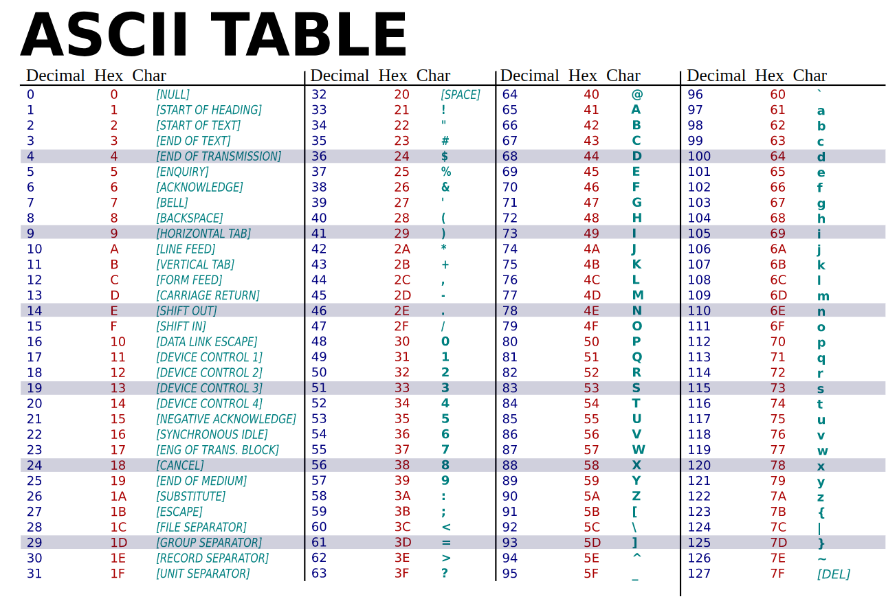

<h1 align="center">Intensivão de Assembly - Com Rafael Sousa</h1>

<p align="center">Codigo apresentado pelo Rafael Sousa durante a live de Intensivão de Assembly no canal Guia Anônima no youtube</p>

<h2 align="center">Gerar executavel</h2>

<h3> Primeiro gerar o codigo objeto</h3>

```
nasm -f elf fileName.asm
```

onde *-f elf* é o parametro de formato para linux


<h3> Linkar as bibliotecas necessarias</h3>

```bash
$ ld -m elf_i386 -s -o outputFileName fileName.o
```

<h3>Executar o programa</h3>

```bash
$ ./outputFileName
```

<h3>Resultado:</h3>

```bash
$ Hello Word
```

<h2 align="center">Anotações</h2>

* intel instruction set esta no manual na pasta assets 

* edb-debugger


<h2 align="center">ASCII Table</h2>

